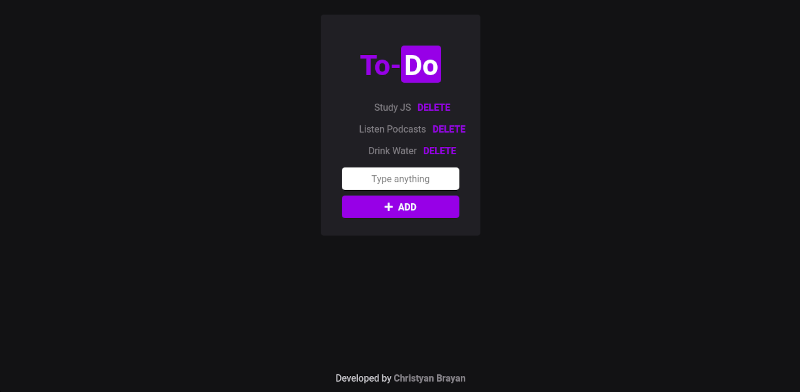

# Simple To-Do JS Application
## Based on the simple project developed on [JS Starter Course](https://app.rocketseat.com.br/node/curso-java-script) of [Rocketseat](https://rocketseat.com.br/), taught by [Diego Fernandes](https://github.com/diego3g)
- HTML5;
- CSS3;
- JavaScript;
- CSS reset by [Normalize.css](https://necolas.github.io/normalize.css/);
- Icons by [Font Awesome](https://fontawesome.com/);
- Fonts by [Google Fonts](https://fonts.google.com)
- Hospeded with [GitHub Pages](https://pages.github.com/);

The design was based on [Rocketseat Website](https://app.rocketseat.com.br)

Acess [here](https://christyanbrayan.github.io/to-do)!

### Contributors
- [@flubyGit](https://github.com/flubyGit)
- [@lucianesantcs](https://github.com/lucianesantcs)
- [@SiqueiraDev](https://github.com/siqueiradev)

Licensed by [MIT](LICENSE)

Also want contribute with anything? Open an [issue](https://github.com/christyanbrayan/to-do/issues/new) or [PR](https://github.com/christyanbrayan/to-do/pulls)!

---

<h4 align="center"> <em>&lt;/&gt;</em> by <a href="https://github.com/christyanbrayan" target="_blank">christyanbrayan</a> </h4>
